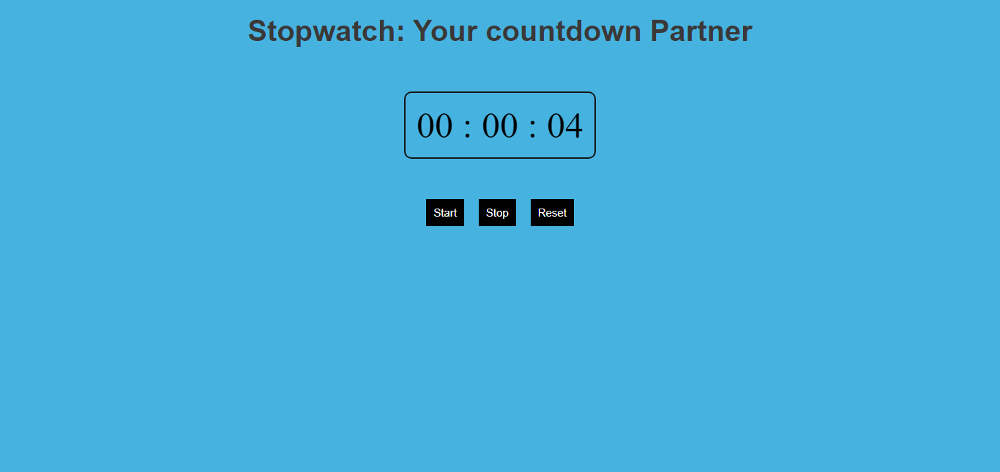

# Stopwatch built with HTML, CSS and Vanilla JavaScript

## The UI of the App has been made with pure HTML and CSS with logic written purely in Vanilla JavaScript. 

- Made use of `setInterval` and `clearInterval` to bring asynchronous functionality and interval timing features as required by the application.

Here is how the web app looks:

